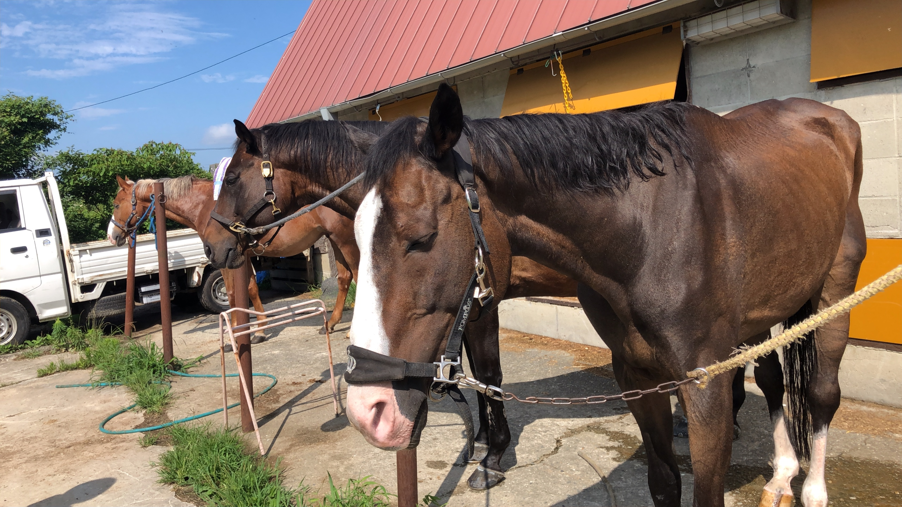
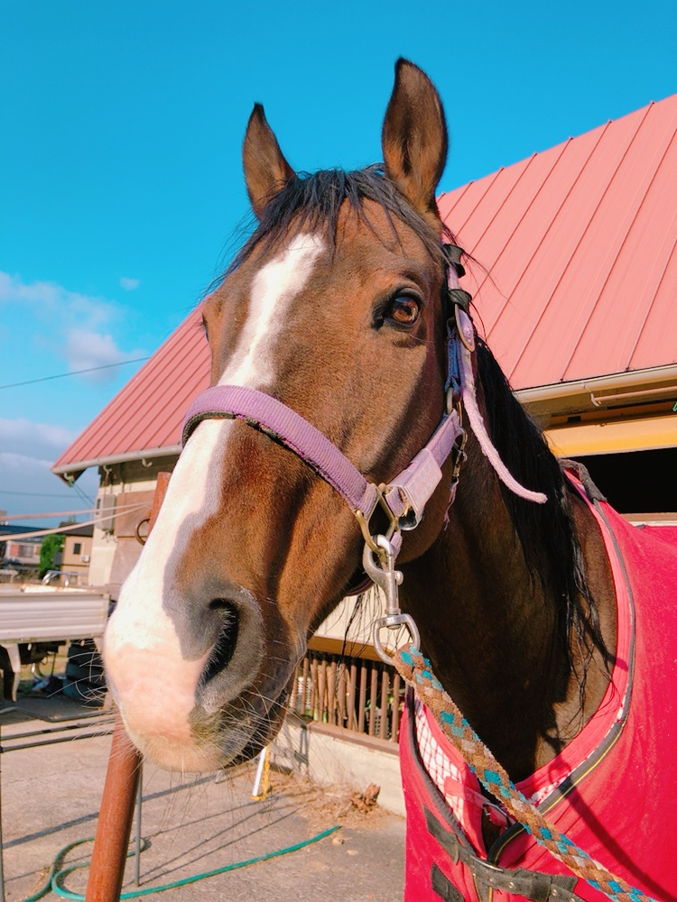
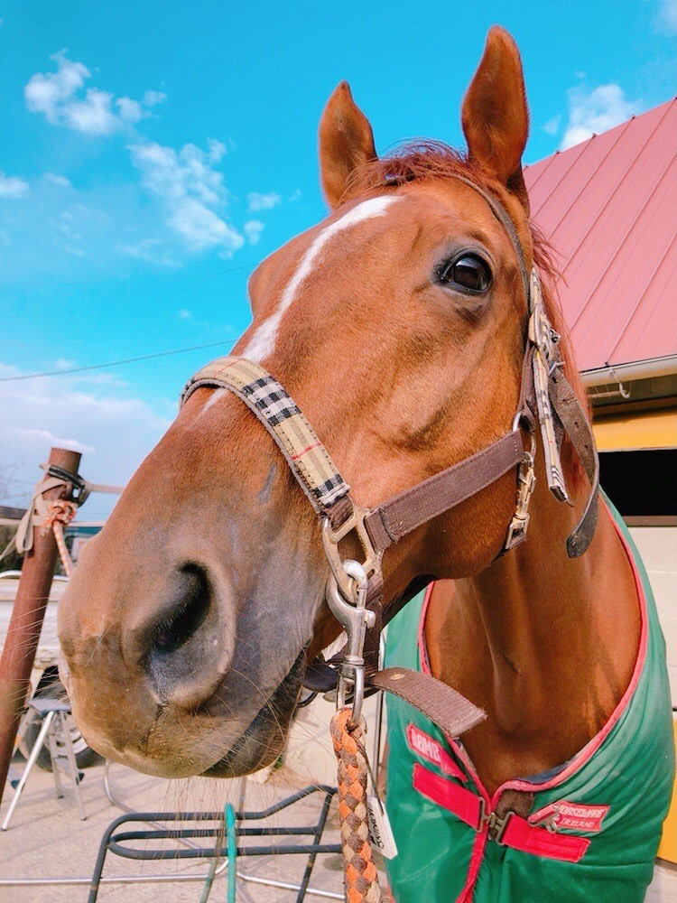
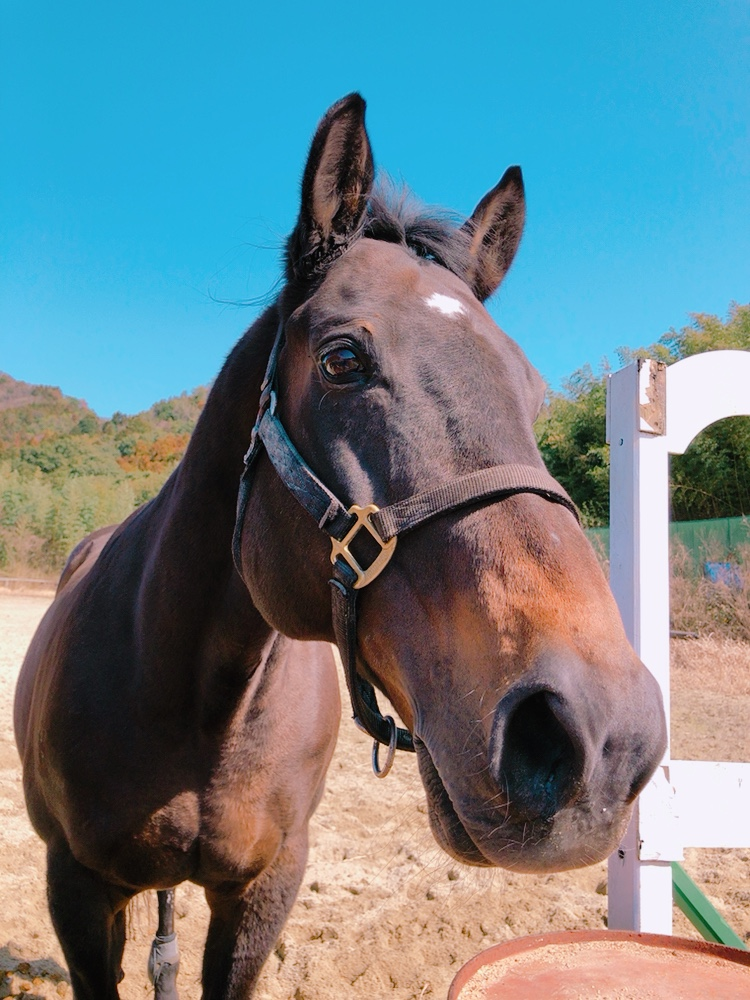
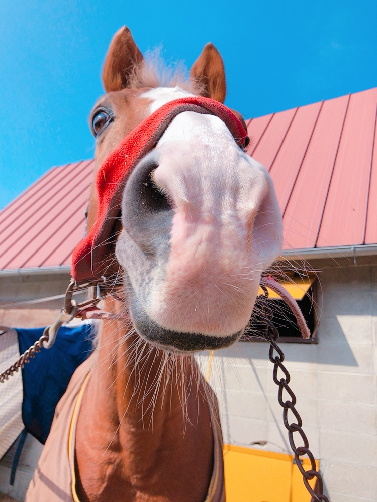

# ∼Welcome to Yamaguchi-Univ. Equestrian Club∼

　現在、部員4名と馬匹4頭で活動中です。
  
　活動時間は朝6時～8時まで、休日や長期休業中は普段よりも活動終了時刻が遅めとなっております！

## 【お知らせ】

- [新入部員募集中](部員募集.html)

- [ドラゴンメッシュ号 宇部乗馬クラブへ預託 (2020/02/01)](メッシュ.html)

- [ブレシドクラウン号 永眠 (2019/07/24)](ブレ.html)

 
### 【馬匹紹介】

　当馬術部の在厩馬をご紹介いたします。各馬の詳細につきましては、画像をクリックしてご覧ください。
  
[離厩馬の紹介](離.html) 
　離厩馬につきましては、簡易的な紹介のみとさせていただきますのでご了承ください。

#### [【日々の活動】](Daily.html)
　活動風景や試合結果等をお知らせいたします。

##### [【支援のお願い】](寄付のお願い.html)
　相次ぐ部員の退部により財政面・体制面で非常に厳しい状態となっております。馬術部存続のため、部員一同精進して参りますので、ご理解の上ご支援を賜りたくよろしくお願いいたします。
   
　詳細につきましては、リンク先をご覧ください。

##### [【お問い合わせ】](問い合わせ.html)
　見学等で厩舎や馬場に御用の方はこちらをご覧ください。
   

