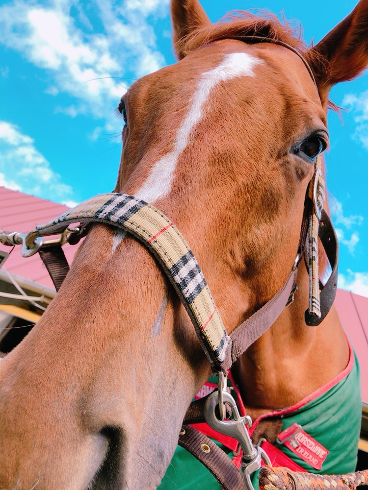

# アナバティック号

<table>
    <tr>
        <td rowspan="8"></td>
        <th>品種</th><td>サラブレッド</td>
    </tr>
    <tr>
        <th>性別</th><td>セン</td>
    </tr>
    <tr>
        <th>毛色</th><td>栗毛</td>
    </tr>
    <tr>
        <th>血統</th><td>父：アルカセット 母：サンチェッス</td>
    </tr>
    <tr>
        <th>生年月日</th><td>2007年03月30日</td>
    </tr>
    <tr>
        <th>産地</th><td>北海道</td>
    </tr>
    <tr>
        <th>馬主</th><td>山口大学体育会馬術部</td>
    <tr>
        <th>得意競技</th><td>障害飛越</td>
    </tr>
    </tr>
</table>

 