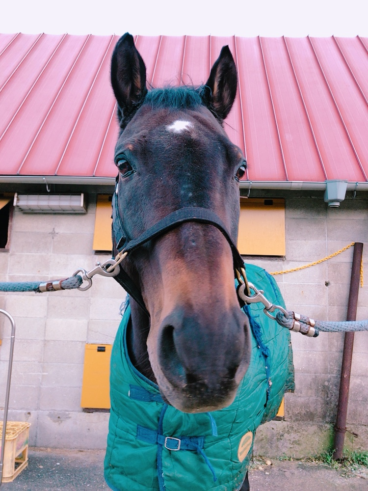

# シマカゼ号

<table border="1">
    <tr>
        <th rowspan="8"></th>
        <td>品種</td>
        <td>アングロアラブ</td>
    </tr>
    <tr>
        <td>性別</td>
        <td>セン</td>
    </tr>
    <tr>
        <td>毛色</td>
        <td>鹿毛</td>
    </tr>
    <tr>
        <td>血統</td>
        <td>父：ホーエイヒロボーイ 母：ケイアイシマウタ</td>
    </tr>
    <tr>
        <td>生年月日</td>
        <td>2001年03月02日</td>
    </tr>
    <tr>
        <td>産地</td>
        <td>北海道</td>
    </tr>
    <tr>
        <td>馬主</td>
        <td>山口大学体育会馬術部</td>
    </tr>
    <tr>
        <td>得意競技</td>
        <td>馬場馬術</td>
    </tr>
</table>

 