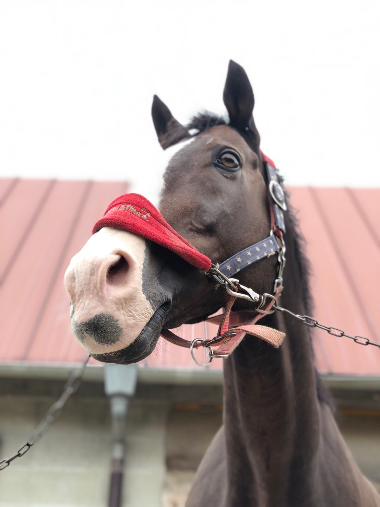
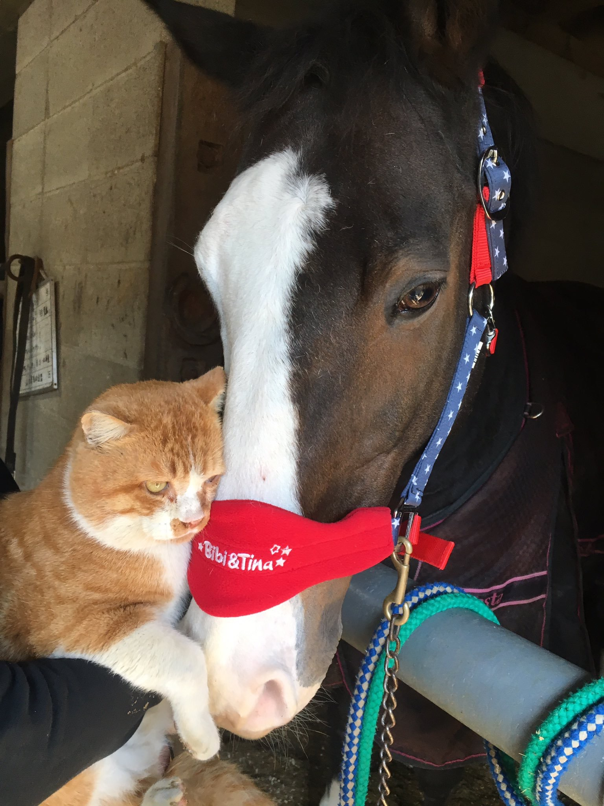
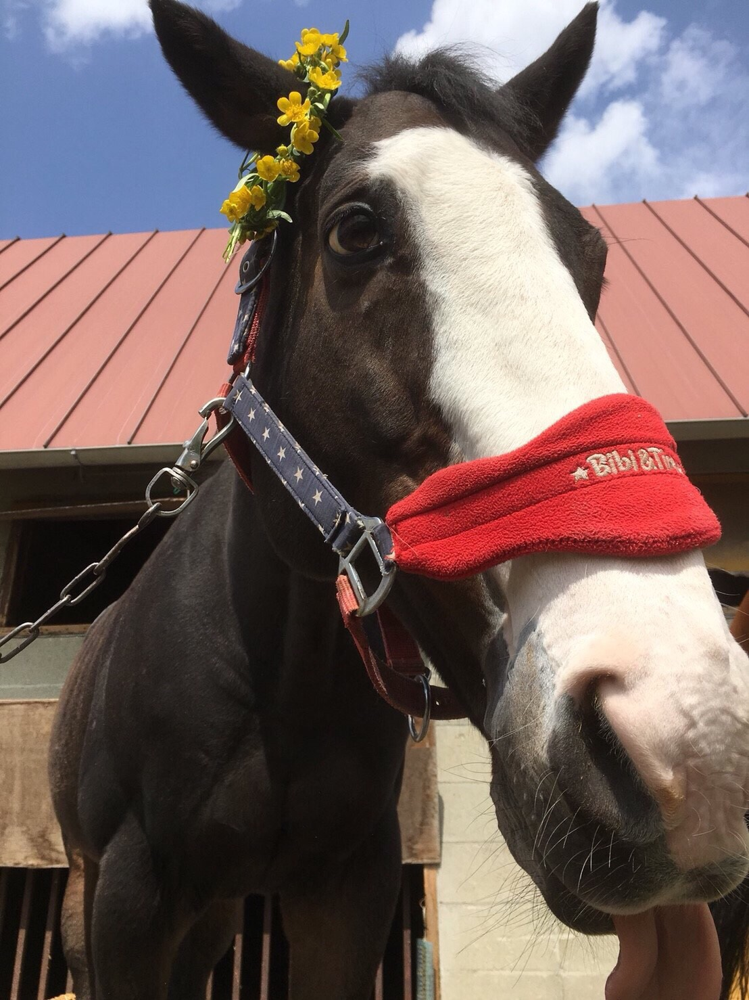

　ご報告が遅くなりましたが、ブレシドクラウン号が2019/07/24に亡くなりました。朝6：00に部員が起立不能を発見、牽引しても立たず、8：00頃にバナミン投与。牽引により立つも両前肢とも体重に耐えられず倒れたため、予後不良と判断し安楽殺となりました。21歳でした。

　病理解剖の結果、右前膝のフレグモーネは治まっていたものの関節が変形した状態で上手く負重できず、左前肢球節は負重に耐えられず腱が伸び球節が沈んだことから起立不能となったことが分かりました。

　ブレシドクラウンを支援してくださった皆様、ありがとうございました。最後まで食欲はあったため、差し入れで頂いたニンジン等はよく食べていました。OG.OBの方々が合いに来てくださってブレも喜んでいたと思います。

