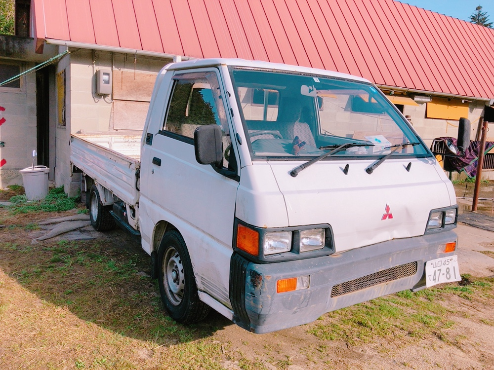
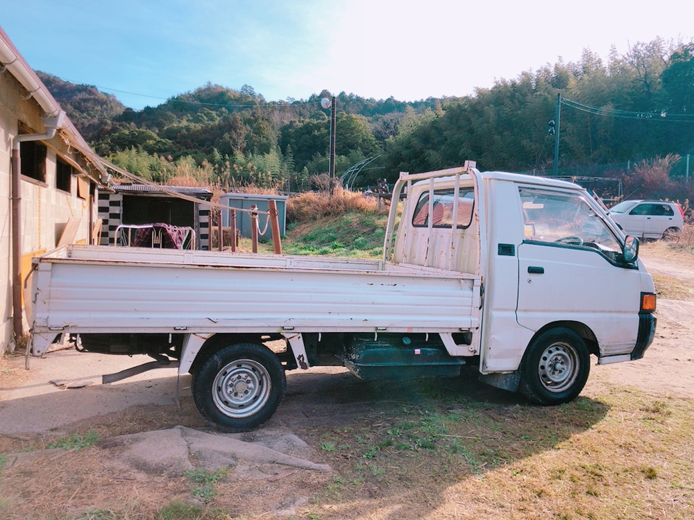

# 寄付のお願い
　この1~2年の間に退部者が続き、体制及び財政面で非常に厳しい状況になっております。
対策として、本年2月に宇部乗馬クラブに馬匹を預かっていただいたり、少ない人数でアルバイト(小倉競馬場)などをしたりして部活動を継続しているのが現状です。私ども部員は、馬術部を存続させ、新年度には新入部員を迎えたいと思っています。

　つきましては、ぜひ皆様のお力をお借りしたく、寄付金をお願いする次第です。
どうか、ご理解の上ご支援を賜りたくよろしくお願いいたします。

　　　  寄付金のお振り込み先

　　　　　　　　    山口銀行 湯田支店　普通 6209063
　  
　　　　　　　　　　　　　　　　　　　　　　　　　　　　　　　　　　　　　　　山口大学体育会馬術部 部員一同

## 寄贈のお願い
　このたび、バイト(飼料代のため)や乗馬クラブ(練習のため)への移動手段として馬術部で所有しておりました軽自動車の修理代が高額になってきたため、廃車にいたしました。つきましては、自動車を新しく購入予定の方・自動車免許を返納予定の方がいらっしゃいましたら、廃車予定のお車を馬術部に寄贈していただきたく、お願いする次第です。車種といたしましては、維持費等の観点から軽自動車を希望いたしております。

　また、馬術部所有の3人乗りトラックも修理代が高額になってきておりますので、こちらもご寄贈いただけましたら幸いです。トラックは、ボロ捨て、おが粉運び、飼料運び等に使用するため軽トラックより大きめのトラックが必要になっております。

　寄贈可能な方がいらっしゃいましたら、以下の連絡先までご連絡ください。重ね重ねのお願いで大変恐縮ですが、どうぞ宜しくお願いいたします。

　　　　　　　　　　　　　　　【現在所有している3人乗りトラック(デリカ)】

　　　連絡先：

　　　　　　　　　　　　　　　　　　　　　　　　　　　　　　　　　　　　　　　山口大学体育会馬術部部員一同

　　　　　　　　　　　　　　　　　　　　　　　　　　　　　　　　　　　　　　　
