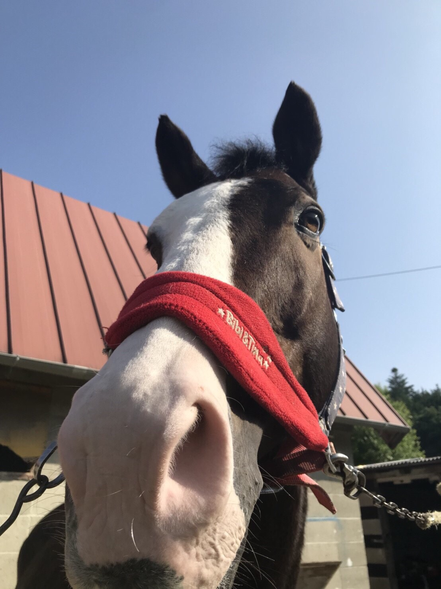
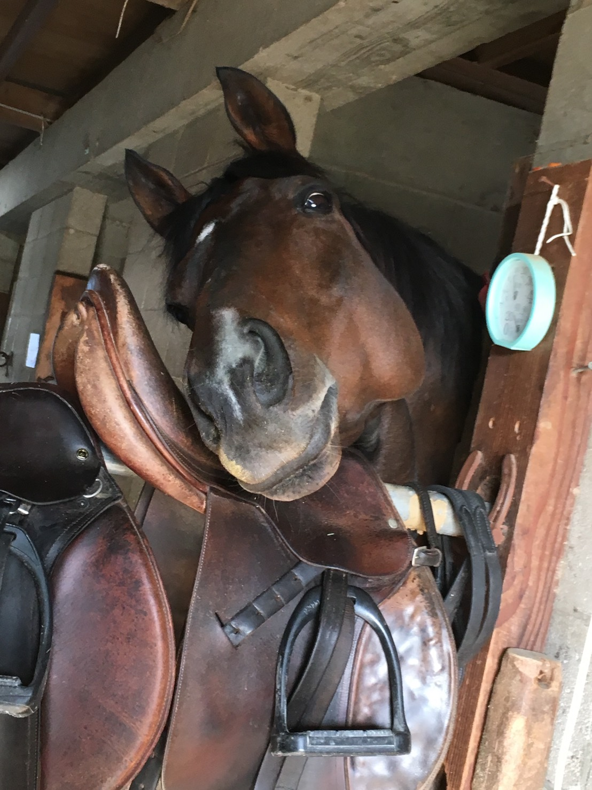

# 離厩馬の紹介

**【ドラゴンメッシュ】**　※ 一時預託(宇部乗馬クラブ)
<table>
    <tr>
        <td rowspan="8"></td>
        <th>品種</th><td>サラブレッド</td>
    </tr>
    <tr>
        <th>性別</th><td>セン</td>
    </tr>
    <tr>
        <th>毛色</th><td>栗毛</td>
    </tr>
    <tr>
        <th>血統</th><td>父：クロフネ 母：ファストフレンド</td>
    </tr>
    <tr>
        <th>生年月日</th><td>2007年02月10日</td>
    </tr>
    <tr>
        <th>産地</th><td>北海道</td>
    </tr>
    <tr>
        <th>馬主</th><td>山口大学体育会馬術部</td>
    </tr>
    <tr>
        <th>得意競技</th><td>障害飛越</td>
    </tr>
</table>

 

**【ブレシドクラウン】**　※ 永眠
<table>
    <tr>
        <td rowspan="8"></td>
        <th>品種</th><td>サラブレッド</td>
    </tr>
    <tr>
        <th>性別</th><td>セン</td>
    </tr>
    <tr>
        <th>毛色</th><td>黒鹿毛</td>
    </tr>
    <tr>
        <th>血統</th><td>父：ホワイトマズル 母：クインズクラウン</td>
    </tr>
    <tr>
        <th>生年月日</th><td>1998年04月19日</td>
    </tr>
    <tr>
        <th>産地</th><td>北海道</td>
    </tr>
    <tr>
        <th>馬主</th><td>山口県馬術連盟</td>
    </tr>
    <tr>
        <th>得意競技</th><td>障害飛越</td>
    </tr>
</table>

 

**【燦鳳(アポロ)】**　※ 岩国乗馬クラブ
<table>
    <tr>
        <td rowspan="8"></td>
        <th>品種</th><td>サラブレッド</td>
    </tr>
    <tr>
        <th>性別</th><td>セン</td>
    </tr>
    <tr>
        <th>毛色</th><td>鹿毛</td>
    </tr>
    <tr>
        <th>血統</th><td>父：サンキリコ 母：プロメテル</td>
    </tr>
    <tr>
        <th>生年月日</th><td>2001年03月14日</td>
    </tr>
    <tr>
        <th>産地</th><td>熊本県</td>
    </tr>
    <tr>
        <th>馬主</th><td>山口大学体育会馬術部</td>
    </tr>
    <tr>
        <th>得意競技</th><td>障害飛越</td>
    </tr>
</table>

 

**【セトウチアキレス】**
<table>
    <tr>
        <td rowspan="8"></td>
        <th>品種</th><td>サラブレッド</td>
    </tr>
    <tr>
        <th>性別</th><td>セン</td>
    </tr>
    <tr>
        <th>毛色</th><td>鹿毛</td>
    </tr>
    <tr>
        <th>血統</th><td>父：フォーティナイナー 母：グリーンスプレーマ</td>
    </tr>
    <tr>
        <th>生年月日</th><td>2004年04月13日</td>
    </tr>
    <tr>
        <th>産地</th><td>北海道</td>
    </tr>
    <tr>
        <th>馬主</th><td>山口大学体育会馬術部</td>
    </tr>
    <tr>
        <th>得意競技</th><td>馬場馬術</td>
    </tr>
</table>

 

**【ハルシオン】**　※ 永眠
<table>
    <tr>
        <td rowspan="8"></td>
        <th>品種</th><td>アングロアラブ</td>
    </tr>
    <tr>
        <th>性別</th><td>セン</td>
    </tr>
    <tr>
        <th>毛色</th><td>鹿毛</td>
    </tr>
    <tr>
        <th>血統</th><td>父：キタジマオー 母：カツハヤクイン</td>
    </tr>
    <tr>
        <th>生年月日</th><td>1995年05月05日</td>
    </tr>
    <tr>
        <th>産地</th><td>北海道</td>
    </tr>
    <tr>
        <th>馬主</th><td>山口大学体育会馬術部</td>
    </tr>
    <tr>
        <th>得意競技</th><td>障害飛越 馬場馬術</td>
    </tr>
</table>
  
